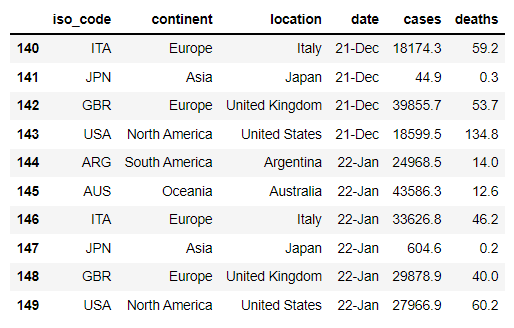
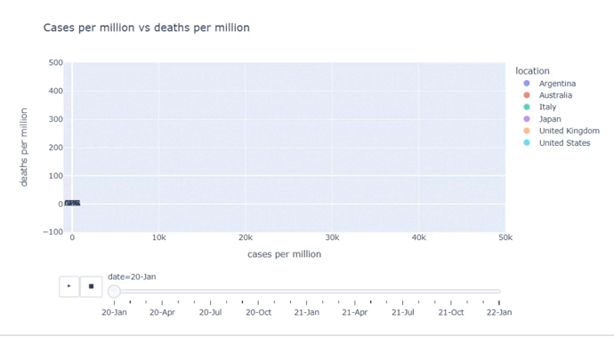
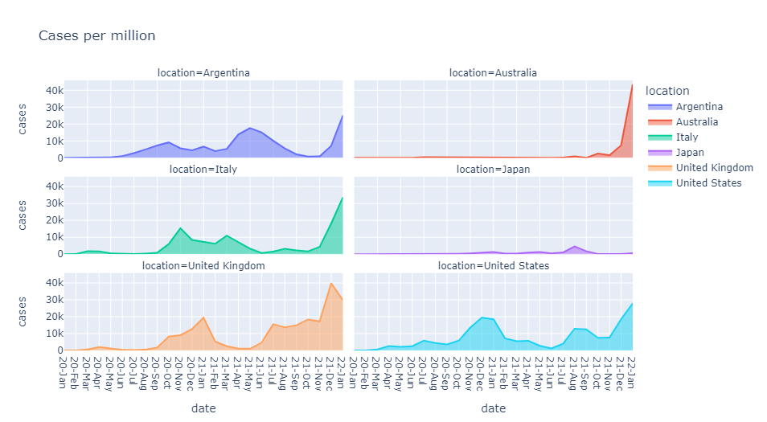
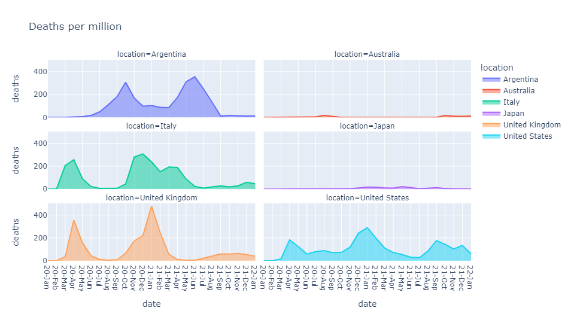
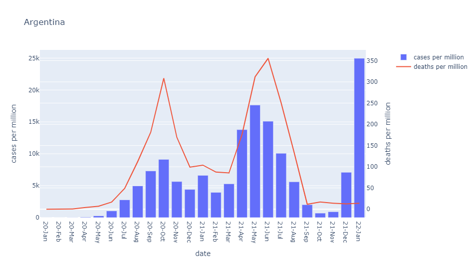
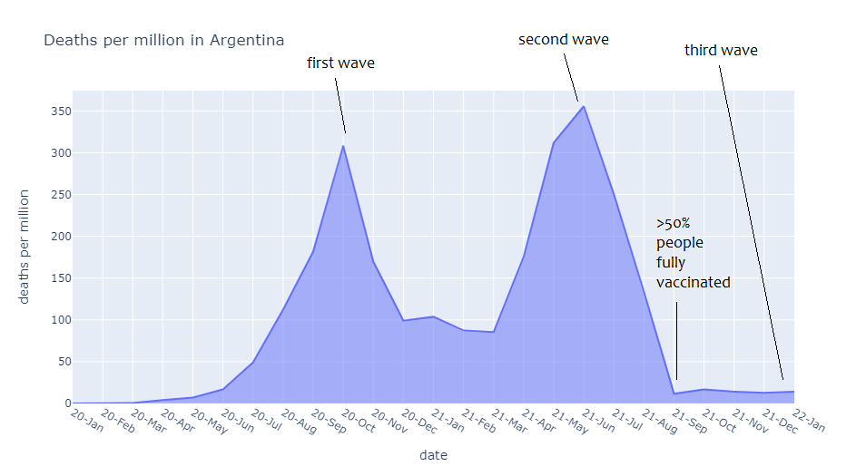
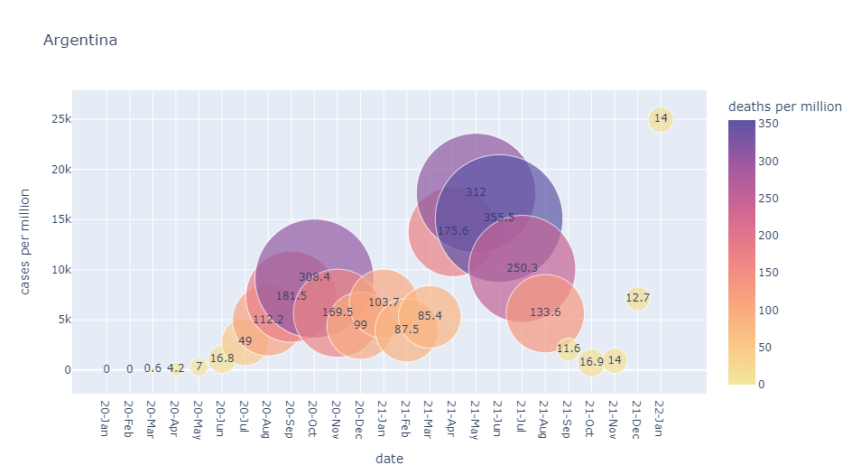

# COVID-19: cases and deaths
* This report analyzes cases and deaths attributed to COVID-19 since January, 2020.

## Code and Resources Used 
**Python Version:** 3.7  
**Packages:** pandas, plotly

## Dataset

Data was collected from [Our World in Data](https://github.com/owid/covid-19-data/tree/master/public/data). Variables analyzed:  
* `iso_code`: ISO 3166-1 alpha-3 – three-letter country codes.
* `continent`: continent of the country.
* `location`: name of the state or federal entity.
* `date`: date of the observation (year-month).
* `cases`: new confirmed cases of COVID-19 per 1M people.
* `deaths`: new deaths attributed to COVID-19 per 1M people.

# Cases vs deaths in different countries

It is observed how the plot started with cases lower than 20k but many deaths attributed to COVID-19. By the end of 2021 and begining of 2022, values are below 100 and in some countries near 0 in y-axis showing the high contagiousness of the Omicron variant circulating and causing many cases and the good effectiveness of the vaccines reducing significantly the deaths. It is also noticed that COVID-19 arrived first in Europe or North America countries. Besides, the countries in opposite hemispheres show different behaviors in the coldest or warmest months. For example, Argentina shows the highest number of cases in May - June 2021, while northern countries such as United Kingdom or the United States show the highest in December 2020 and January 2021.

## Cases per million

This plot shows the different waves of COVID-19 through time.  

## Deaths per million

Here we could observe the effectiveness of vaccines in the last period of time.

# Argentina

Here we observe the dates when different COVID-19 waves happened in Argentina. First one in October 2020 and second one in May - June 2021, both with high number of deaths. The third wave is already happening, in January 2022, but it is well observed the low number of deaths in this case thanks to vaccines effectiveness.

## Deaths per million in Argentina

## Cases and deaths per million in Argentina

